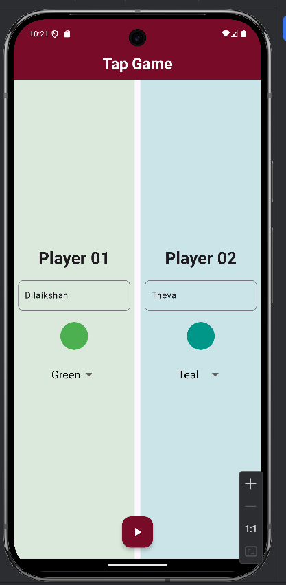
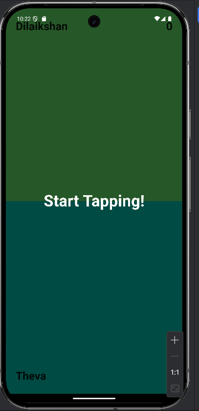
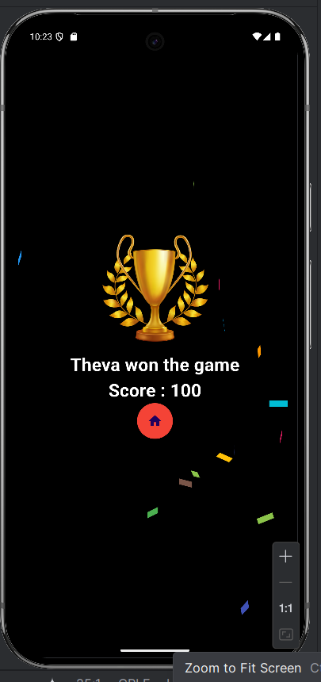
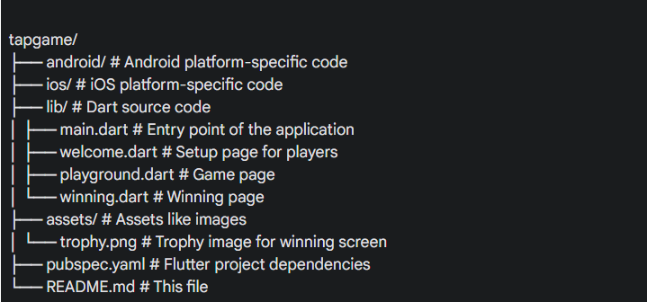

# Tap Game

A simple two-player tap game built with Flutter. Players compete to fill their screen with color by tapping.

## Overview

This Flutter project is a basic two-player tapping game. Players enter their names and choose distinct colors. The game screen splits into two sections, each displaying a player’s name and their chosen color. Players tap on their area to increase its color fill. The first player to fill 80% of their area wins.

## Features

*   **Two-Player Gameplay:** Supports two players on a single device.
*   **Player Setup:**
    *   Players can enter their names.
    *   Players can select distinct colors.
*   **Dynamic UI:**  Background colors and player names displayed dynamically.
*   **Game Logic:**  Tapping increases the color fill, and a winner is declared when one player fills their area.
*   **Overlay:** Shows countdown before game start.
*   **Winning Screen:** Displays winning name, score and confetti effect
*   **Navigation:** User can play a new game after finish the current game.

## Screenshots

**
**
**


## How to Run

1.  **Clone the repository:**
    ```bash
    git clone https://github.com/Dilaikshan/Tap-Game.git
    ```
2.  **Navigate to the project directory:**
    ```bash
    cd [tapgame]
    ```
3.  **Install dependencies:**
    ```bash
    flutter pub get
    ```
4.  **Run the app:**
    ```bash
    flutter run
    ```

## Project Structure



## Dependencies

This project uses the following Flutter packages:

*   `confetti: ^0.7.0`
*   `flutter: sdk: flutter`

## Known Issues
*   No known issues.

## Contributing

Contributions are welcome! Please feel free to submit issues or pull requests.

## License

This project is licensed under the MIT License - see the [LICENSE](LICENSE) file for details.